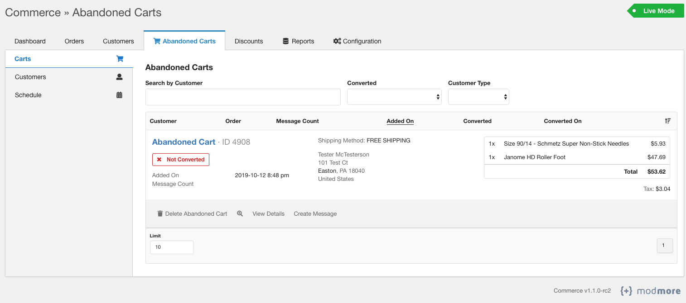

# Abandoned Cart for Commerce (WIP)



Over 75% of customers abandon their online shopping carts - recover some of these lost sales with the Abandoned Cart module for [Modmore's Commerce](https://modmore.com/commerce/) for MODX. This Abandoned Cart module allows you to schedule when to send emails to potential customers with an advanced conditions engine to determine what messages to send to specific segments. Use native Twig templating and HTML to build powerful email templates to fit your business needs.

**Features**:

- Schedule automated emails to send to customers who have abandoned their cart
- Send automated emails based on sets of conditions (supporting order and address targeting)
- Use completely customizable email templates to fit your brand and business needs
- Track conversion of previously abandoned carts
- Customer subscription management to allow customers to opt out of abandoned cart emails
- Export abandoned cart customer information using native Modmore Commerce reports (CSV, Excel, XML, JSON, HTML)

## Installing the Package

1. Install the transport package in MODX Extras -> Installer
2. Go to Extras -> Commerce -> Configuration -> Modules
3. Find and enable the Abandoned Cart module

### Module Configuration

When you enable the Abandoned Cart module, there is a configuration option "Converted On Method". This configuration option allows you to change when the Abandoned Cart module detects that the order has been completed.

This has two available options; either when the order is moved to processing or when the thank you step displays in checkout.

- "Order Moved to Processing" uses the Commerce event "\Commerce::EVENT_STATE_CART_TO_PROCESSING". This event runs when the markProcessing function on the Commerce comCartOrder object is called (generally when all payments are received). This is the default option and is suitable for most shops.
- "Thank You Step" uses the Commerce event "\Commerce::EVENT_CHECKOUT_AFTER_STEP". This event runs when the current step = thankyou (final step of checkout). This option may be suitable for some shops depending on how orders are fulfilled

See more information on Commerce events here: https://docs.modmore.com/en/Commerce/v1/Developer/Modules/Events.html

## Setting up the Cronjob

The cronjob script is located in assets/components/commerce_abandonedcart/run.php. This script sends scheduled abandoned cart messages. It will need to be configured in your server's crontab.

### Example

This example runs the cronjob script every 5 minutes.

```
*/5 * * * * /usr/bin/php /var/www/html/assets/components/commerce_abandonedcart/run.php > /dev/null 2>&1
```

**Make sure to replace /var/www/html with the actual path of your web root.**

### Securing the Cronjob

By default, the cronjob is allowed to run via a web request (to enable the usage of web-based cron services). It is recommended to disable web access for security by changing the following system setting in MODX to "No": `commerce_abandonedcart.web_cron`. This will prevent requests from the web from running the script to send abandoned cart emails.

## License

[MIT](https://github.com/poconosewandvac/Commerce_AbandonedCart/blob/master/core/components/commerce_abandonedcart/docs/license.txt)